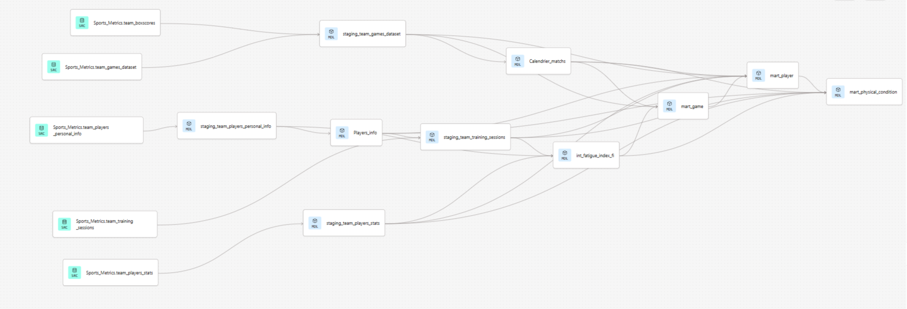

# SportMetrics : Plateforme d'Analytics & Prédiction de Performance

## Contexte du Projet : Les "Foufous de Sochaux" (FFS)

Le club professionnel des **Foufous de Sochaux** traverse une phase de transformation majeure. Malgré l'acquisition massive de données via des capteurs biométriques (IoT), le staff technique et médical rencontrait des difficultés pour corréler la fatigue des joueurs avec les résultats sportifs et l'augmentation des blessures en milieu de saison.

**Objectifs de la mission :**
* **Load Management :** Prévenir les blessures en pilotant l'intensité des entraînements par la donnée.
* **ADN de la Victoire :** Identifier les indicateurs statistiques critiques qui différencient une victoire d'une défaite.
* **Optimisation du Roster :** Profiler les joueurs pour aider le coach dans ses rotations et le choix du "5 de départ".

---

## Architecture Technique


La stack est entièrement **dockerisée** et indépendante de tout environnement tiers. Une seule commande suffit pour lancer l'ensemble du pipeline :

```bash
docker compose up -d
```

### Stack technique

| Outil | Rôle |
|---|---|
| **Apache Airflow** | Orchestration — déclenche le pipeline chaque matin à 6h |
| **n8n** | Ingestion — extrait les Google Sheets et charge dans BigQuery |
| **Google BigQuery** | Data Warehouse — couches Raw → Staging → Mart |
| **dbt Core** | Transformation ELT — 10 modèles, PASS=10 |
| **XGBoost** | ML — prévention des blessures (1623 prédictions/run) |
| **KMeans** | ML — profilage tactique des joueurs (20 joueurs, k=3) |
| **Power BI** | Analytics & KPIs — Dashboard Performance 360° |
| **Jupyter Lab** | Exploration & développement ML (localhost:8888) |
| **Slack** | Alertes automatiques sur failure du pipeline |
| **PostgreSQL** | Base de données interne Airflow |

### Pipeline de données

```
Google Sheets → n8n → BigQuery → dbt → ML (XGBoost + KMeans) → Power BI
                                  ↑
                         Orchestré par Airflow
```

---

## 1. Ingestion & Orchestration

**Sources de données :** Les données biométriques (IoT), les journaux d'entraînement et les statistiques de match sont collectés via des formulaires et centralisés dans des fichiers **Google Sheets**.

**Collecte (n8n) :** Workflow automatisé qui extrait les 5 sources CSV depuis Google Sheets et les charge dans BigQuery via webhook. Contrôle d'intégrité (Compare Datasets) pour éviter les doublons.

**Orchestration (Apache Airflow) :** Chaque matin à 6h00, Airflow déclenche séquentiellement :
1. `execute_n8n_workflow` — appel webhook n8n
2. `dbt_run` — transformations via DockerOperator
3. `ml_injury_prevention` — XGBoost en parallèle
4. `ml_player_clustering` — KMeans en parallèle

Alertes Slack automatiques sur chaque failure avec `on_failure_callback`. Retries exponentiels (3 tentatives, backoff x2).

---

## 2. Stockage & Transformation (BigQuery & dbt)

**Data Warehouse :** Stockage centralisé sur **Google BigQuery** — projet `n8n-automation-485809`.

**Transformation dbt — Architecture en Galaxie (Fact Constellation) :**

**Couche Staging** — nettoyage technique :
* `staging_team_players_personal_info` — infos joueurs
* `staging_team_players_stats` — conversion MM:SS en décimales
* `staging_team_games_dataset` — parsing dates FR/EN
* `staging_team_training_sessions` — imputation biométrique par profil

**Couche Intermediate** — logique métier :
* `int_fatigue_index_fi` — Fatigue Index pondéré (charge interne 30% + charge externe 40% + récupération 30%). Filtre "Garbage Time" < 5 min.

**Couche Marts** — tables analytiques :
* `Players_info`, `Calendrier_matchs` — dimensions communes
* `mart_player` — stats individuelles + score efficience/minute
* `mart_game` — performance collective par match
* `mart_physical_condition` — fatigue, ACWR 7j/28j, alertes blessure



**Data Quality :** Tests dbt automatisés (unicité, not null, accepted values) sur tous les IDs clés. `dbt test` intégré au pipeline Airflow.

---

## 3. Intelligence Artificielle & Machine Learning

Les modèles ML tournent automatiquement après dbt via Airflow (DockerOperator). Les résultats sont écrits directement dans BigQuery et consommés par Power BI.

### Prévention des Blessures — XGBoost

**Objectif :** Passer d'une médecine réactive à une prévention proactive.

**Features :** `Fi_before_match`, `fi_avg_7d`, `fi_max_7d`, `training_load_7d`, `fi_avg_28d`, `training_load_28d`, `Focus_Level`, `minutes_played`, `Position`, `ACWR` (ratio charge aiguë/chronique).

**Problématique :** Les blessures représentent seulement 12% des observations — déséquilibre de classes traité avec `scale_pos_weight = nb_sains / nb_blessés`.

**Règle de gestion graduée :**

| Probabilité | Action |
|---|---|
| ≥ 0.70 | Réduction 80% de l'intensité |
| ≥ 0.50 | Réduction 50% |
| ≥ 0.20 | Réduction 15% — alerte préventive |
| < 0.20 | Entraînement normal |

Résultats écrits dans `ml_injury_predictions` — **1623 prédictions par run**.


### Profilage des Joueurs — KMeans

**Objectif :** Segmenter les joueurs par impact réel sur le terrain plutôt que par poste officiel — saison 2023-2024.

**Méthodologie :** K-Means avec k=3 déterminé par la méthode du coude, sur 8 variables normalisées (StandardScaler) : points, passes, rebonds, interceptions, contres, pertes de balle, fautes, +/-.

**3 profils identifiés :**

| Profil | Label | Stats clés |
|---|---|---|
| 0 | Lieutenant All-Star | 14 pts / 4 passes — créateurs de jeu |
| 1 | Spécialistes du Banc | 6 pts / +/- de -4,37 — recrues en intégration |
| 2 | Pivot Dominant | 21 pts / 11 rebonds / 3,47 contres — Vincent Beaumont |


**Insight clé :** Lucas Dubois (Profil 0, statut remplaçant) affiche un score de performance de 20,9 en sortie de banc — supérieur à plusieurs titulaires. Candidat idéal au 5 de départ.

Résultats écrits dans `ml_player_clusters` — **20 joueurs profilés par run**.


---

## 4. Dashboard Power BI "Performance 360°"

### Page 1 : Load Management & Santé
Monitoring dynamique avec mise en forme conditionnelle pilotée par les prédictions ML : statut Repos (❌), Adapté (⚠️). Suivi du ratio récupération réelle / besoin physiologique par joueur.


### Page 2 : Statistiques & Stratégie
Corrélation Performance/Fatigue — analyse de la chute de l'adresse lors des pics de fatigue. Facteurs de victoire : comparaison des métriques clés entre matchs gagnés et perdus.


### Page 3 : Optimisation du Lineup
Suggestion de lineups basées sur la complémentarité des clusters. Lucas Dubois intègre le 5 de départ, Vincent Beaumont confirmé en Pivot dominant.


---

## 5. Infrastructure Docker

Le projet est entièrement conteneurisé. Structure du repo :

```
Sports_Metrics/
├── Dags/                  ← DAGs Airflow
├── models/                ← modèles dbt (staging, intermediate, marts)
├── macros/                ← macros dbt
├── tests/                 ← tests dbt
├── ml/                    ← scripts ML production (XGBoost, KMeans)
├── analyses/              ← notebooks Jupyter exploration
├── credentials/           ← clé GCP (gitignore)
├── Dockerfile             ← image Airflow custom
├── docker-compose.yml     ← stack complète
├── requirements.txt       ← dépendances Python
└── dbt_project.yml        ← configuration dbt
```

**Lancer le projet :**

```bash
git clone https://github.com/Yohan-Charney/Sports_Metrics
cd Sports_Metrics
cp .env.example .env   # configurer les variables
docker compose build
docker compose up -d
```

**Accès locaux :**
* Airflow : `localhost:8080`
* n8n : `localhost:5678`
* Jupyter : `localhost:8888`

---

## 6. Gestion de Projet Agile

Méthodologie **Agile/Kanban** sur Trello : Backlog → À faire → En cours → À valider → Terminé. Collaboration entre staff médical, coach et équipe Data simulée via user stories.

---

## Conclusion

**SportMetrics** transforme des données IoT complexes en actions concrètes pour les Foufous de Sochaux. Le pipeline automatisé fournit chaque matin des indicateurs frais au staff, permettant de protéger la santé des cadres et d'optimiser les performances collectives grâce à une gestion scientifique de la charge de travail.
